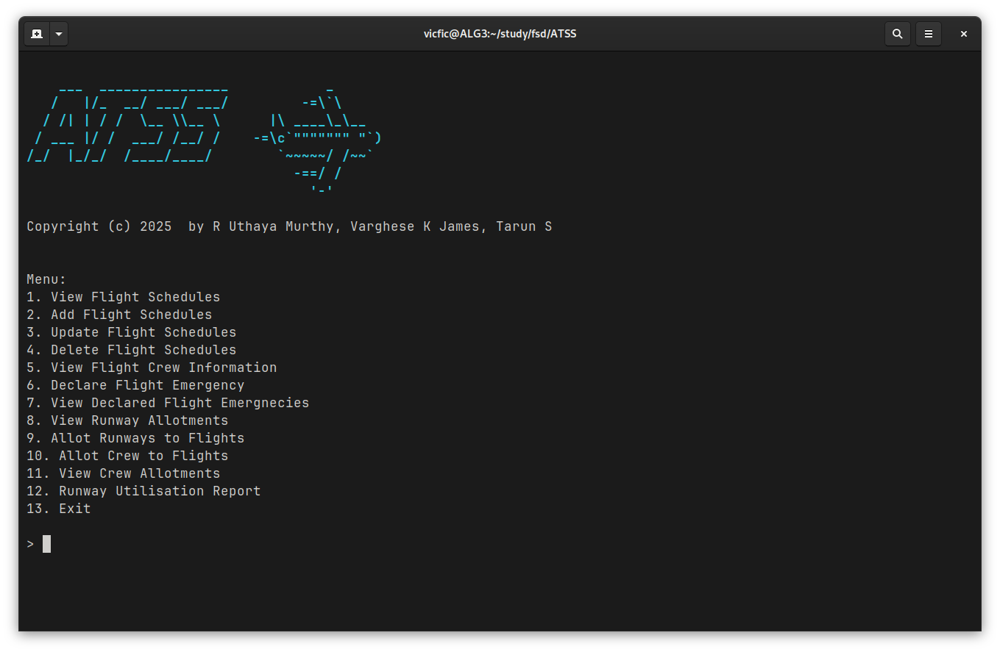
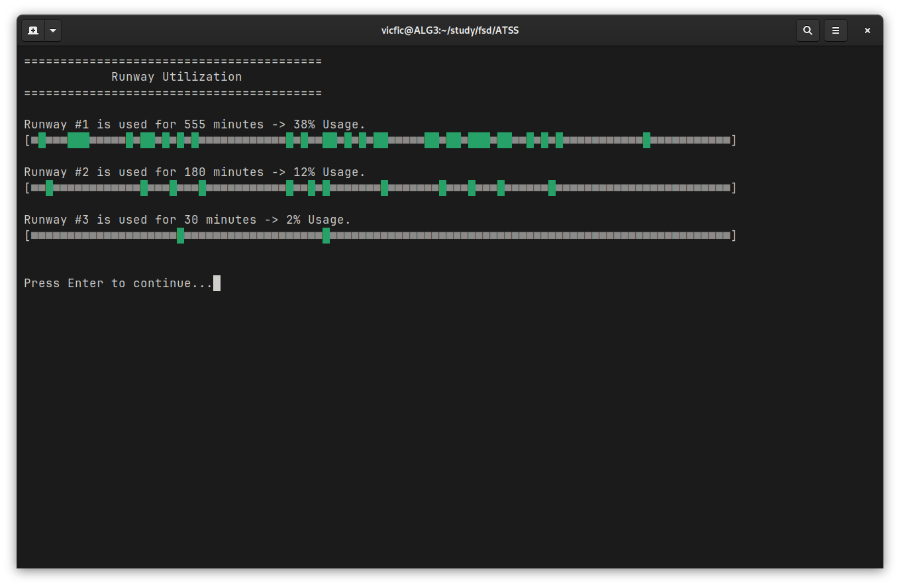
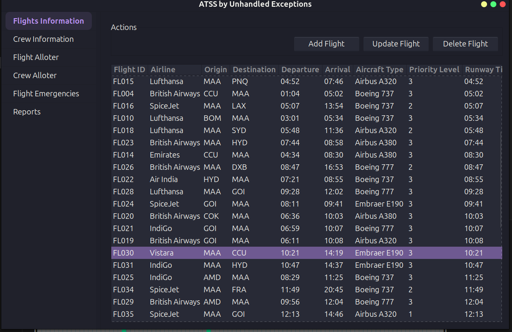
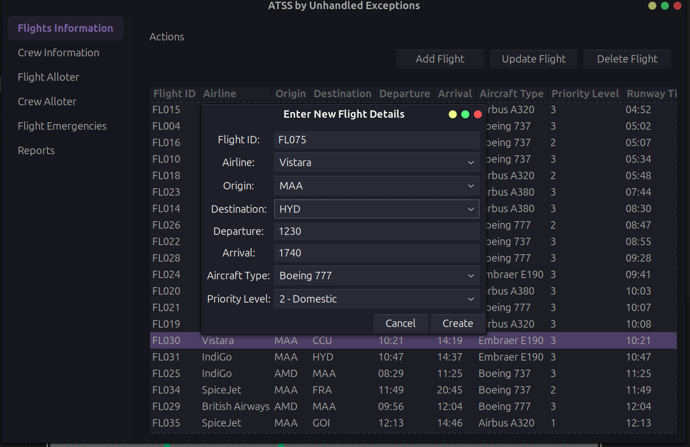
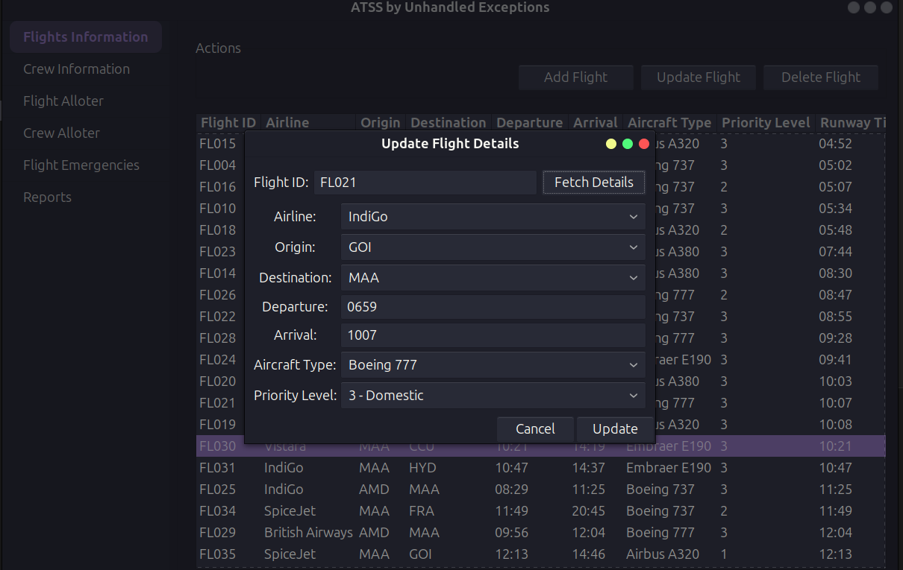
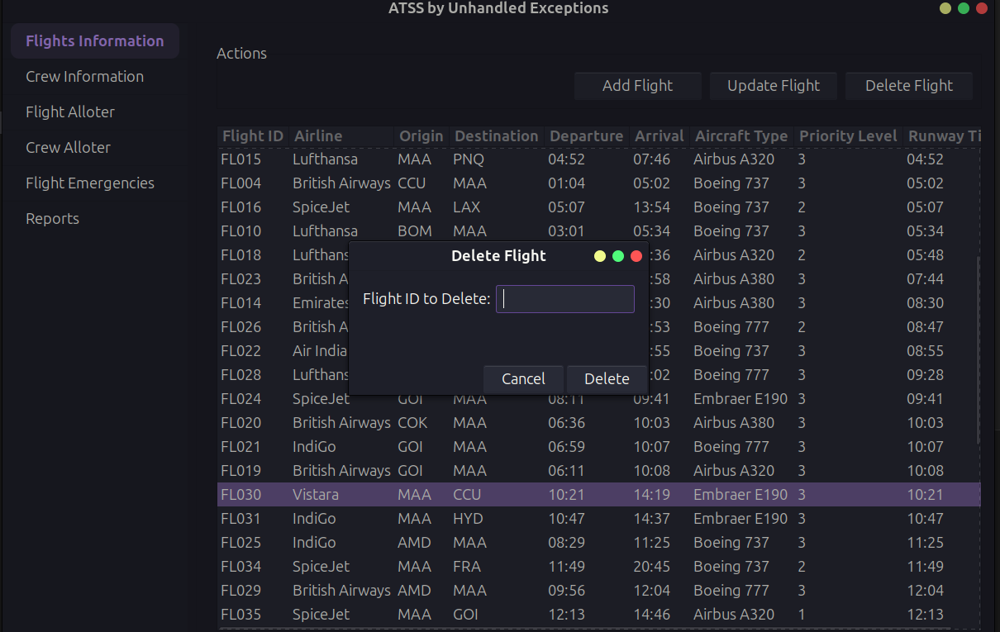
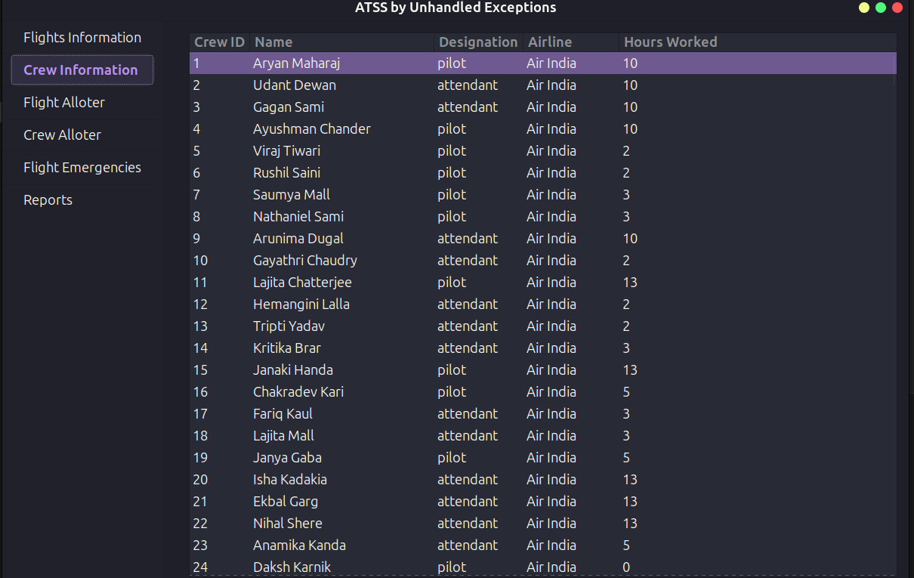
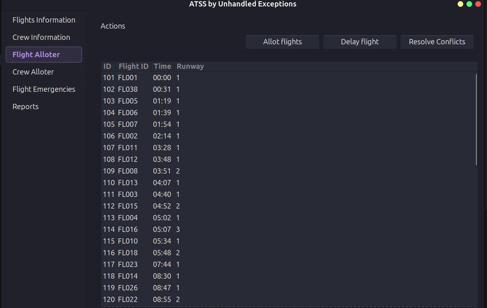
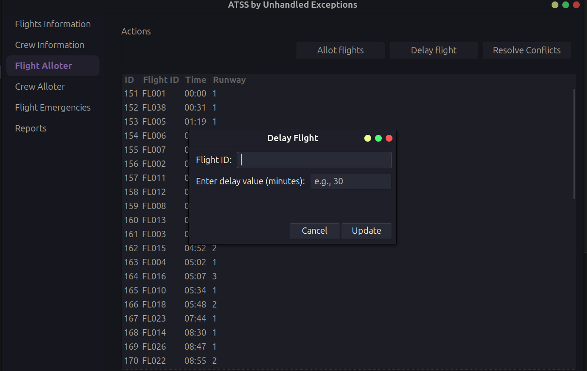
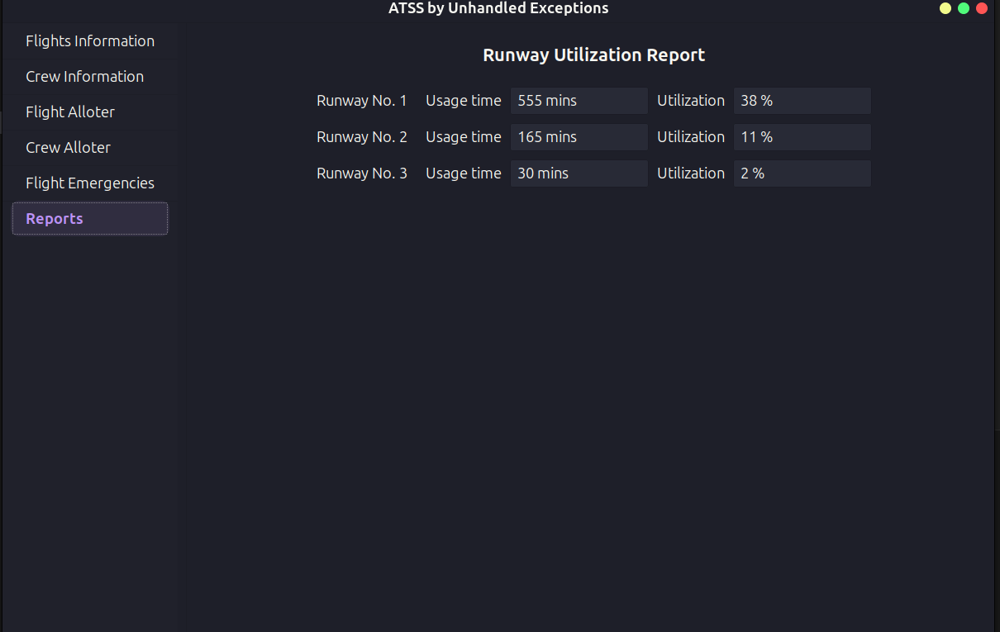

# Air Traffic Scheduling System - ATSS
[](https://www.gnu.org/licenses/gpl-3.0)

A Simple Air Traffic Scheduling simulation System written in C. Has both GUI and CLI versions.

## Screenshots
### CLI

#### Main Menu

#### Flight Allocation Report


### GUI

#### Flights Info


#### Add Flight


#### Update Flights


#### Delete Flight


#### Crew Info


#### Flight Alloter


#### Flight Alloter - Delay


#### Runway Utilisation Report


## Prerequisites
- Any Linux OS (Tested on Arch and Ubuntu)
- gcc
- maketools
- gtk3 developement packages:

For ubuntu based systems:
```
sudo apt install libgtk-3-dev
```
For Arch:
```
sudo pacman -S gtk3
sudo pacman -S base-devel
```

## Usage Instructions

- Clone the repo
```
git clone https://github.com/Unhandled-Exceptions/ATSS.git
```
- Compile the code
```
make
```

- Create the db files (Look at the instructions below)

- Run the executable !!
To run the CLI Version:
```
./bin/atss atss
```
To run the GUI Version:
```
./bin/atss-gui
```

## Sample DB Files creation instructions

Before the first run, make the scripts executable
```
chmod +x data_ref/db_from_csv.py scripts/create_atss_db.sh
```

### Ideal Test Cases
#### Small DB (10 Flights)
```
rm data/atss.db
./scripts/create_atss_db.sh
./data_ref/db_from_csv.py data/flights_small.csv data/crew_small.csv data/atss.db
```

#### Big DB (50 Flights)
```
rm data/atss.db
./scripts/create_atss_db.sh
./data_ref/db_from_csv.py data/flights_big.csv data/crew_big.csv data/atss.db
```

### Busy Test Cases

#### Small DB (10 Flights)
```
rm data/atss.db
./scripts/create_atss_db.sh
./data_ref/db_from_csv.py data/flights_busy.csv data/crew_small.csv data/atss.db
```
#### Big DB (50 Flights)
```
rm data/atss.db
./scripts/create_atss_db.sh
./data_ref/db_from_csv.py data/flights_busy_big.csv data/crew_small.csv data/atss.db
```

## Project Directory Structure:

~~~
ATSS/
│── src/                 # Source Files
│   │── main.c
│── lib/                 # 3rd Party Libraries
│   │── sqlite3.c
│   │── sqlite3.h
│── data/                # .csv and db files
│── scripts/             # scripts to generate db files
│── bin/                 # Compiled binaries
│── Makefile
~~~

> Note: bin/ is created on your pc temporarily while compiling.


## References:

### Useful commands

To see the status of the flights table
```
sqlite3 -table data/atss.db "select * from flights;"
```

### Algorithm for the flight allotement
```
We have 3 tables in the db, `flights`, `crew`, `alloted`.
Flights are sorted according to their `runway_time` and priority.
Iterate through `flights` table:
    if diff of `runway_time`of b/w current flight and last flight in `alloted` table < 15:
        - change runway and try again
        - all runways are blocked? then if the last flight in `alloted` is less priority, kick it into the `delay_pile`
        - otherwise put this current clight into the `delay_pile`
    Now if there is a valid allot spot:
        - loop through sorted `crew` table and assign to the flight

Allotment finished.

Ask the user for clarifications for the `delay_pile`:

    - Loop throught the `alloted` table again for any gaps after the "given" flight time:
        if such a gap exists, then ask user if they want to delay to that spot
    - Else say that there is no option but to cancel the flight.
Generate runway utilization and delay reports.
Done.
```


### Algorithm for the crew allotment
```
we have 3 tables `alloted`, `crew` & `crew_allot`
iterate through each row in `alloted`
    using a forloop, select 4 people (two pilots two attendants)
        if hoursworked > LIMIT choose next person,
        else
            add an entry to the `crew_allot` table with the flight id
            add the hours_worked to `crew`
Done.
```

### Algorithm for finding time slots for delay
```
Params are `flight id` and current `runway_time`
Iterate through each runway
    Iterate through each flight after current `runway_time`,
        If a slot is found, display it, ask for confirmation.
        yes => break;
        no slot found, switch runway. and check again.
No runways are free, then say that the only option is to cancel.
```